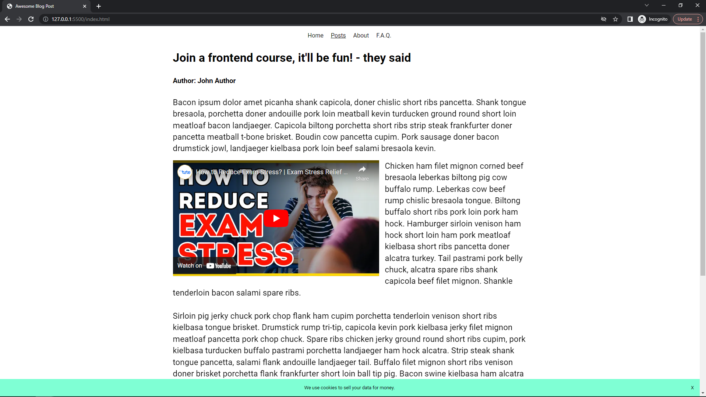
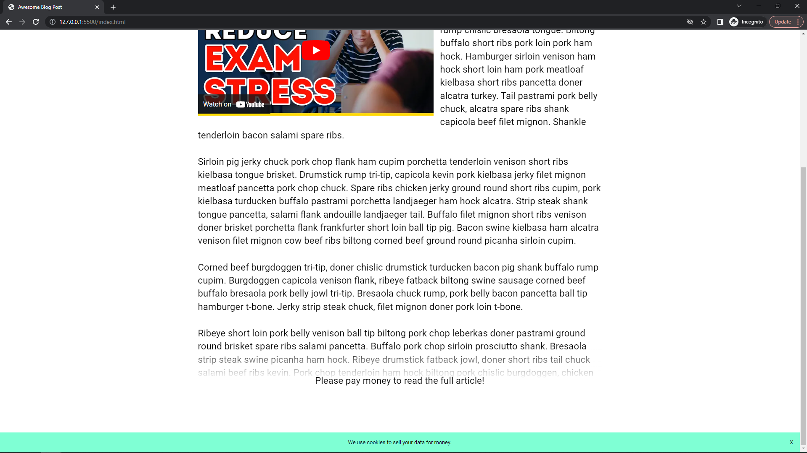

# Frontend 3.0 - 1. részvizsga (gyakorlat)

## Javascript felmérő tesztkörnyezettel (30 pont, feladatonként 10 pont)

Egészítsd ki a függvényeket a **./javascript/exercise.js** fájlban úgy, hogy végrehajtsák az adott feladatot!

Segítségül írtunk console.log-okat, ha szeretnéd jsbinben vagy terminalban node-dal futtatva megnézni a függvényeid müködését.

### Teszt-környezet beállítása:

A teszt környezet futtatásához nodeJS szükséges.
Ellenőrizd a terminalban, hogy megfelelő könyvtárban állsz (ahol a package.json van), utána futasd le a **npm i** parancsot.
Kb. 1 perc alatt telepíti a tesztkörnyezetet. Lehet hogy pár 'warning' üzenet is megjelenik, de az nem feltétlen baj.

### Teszt-környezet ellenőrzése, tesztek futtatása:

Ha lefutott az npm i, akkor ellenőrizd, hogy meg tudod-e hívni a teszteket. Összes teszt futtatásának parancsa:

- **npm run test**

- Tesztek leállítása, ha látszólag valami beszorult: **ctrl + c**

## Weboldal készítése HTML és CSS segítségével (összesen 70 pont)

Készítsd el a képeken látható weboldalt HTML és CSS segítségével! (képek a leírás alatt)

* Törekedj arra, hogy a weboldalad minél inkább hasonlítson a képekre!
* Az oldalon használt margin/padding értéke mindig 8 vagy 16 pixel legyen. Ahol szükséges, ott emellett auto értéket is használhatsz.
* Az oldalnak nem kell reszponzívnak lennie.
* Csak a tanult HTML és CSS eszközökkel dolgozz! Ne használj flexboxot!
* A feladat megoldásához nincs szükség JavaScriptre, annak használata tilos!
* A weblapot az **index.html** fájlban készítsd el, a CSS szabályokat az erre létrehozott **style.css** fájlba írd!

Az oldal szöveges tartalma elérhető a [page-content.txt](page-content.txt) fájlban.

### Szöveg (10 pont)

* A címet és szöveget tartalmaző fő blokk szélessége **960 pixel legyen**, ez a **blokk** (nem maga a szöveg!) legyen a képernyőn **középre igazítva**!
* A szövegtörzs sormagassága és betűmérete is legyen **1.4em**!
* Használj Roboto betűtípust! A betűtípust **ne töltsd le** külön, csak a style.css fájlt módosítsd!
* Ne felejtsd el a weboldal címét beállítani!

### Szemantikus elemek (5 pont)

* Ahol lehet, használj **szemantikus HTML elemeket**!

### Navigációs menü (15 pont)

* A navigációs menüt **HTML lista** segítségével készítsd el!
* A navigációs menünél **ne használj CSS classokat, id-kat**! (bárhol máshol nyugodtan használhatsz!)
* A **második** menüpont legyen aláhúzva (CSS használatával)
* Az **utolsó menüpont** legyen kisbetűvel írva, és CSS-sel tedd nagybetűssé! (f.a.q. -> F.A.Q.)
* Ha a kurzort a **menüpontok felé visszük**, akkor:
  * A háttér legyen piros
  * A kurzor legyen pointer/"mutató kéz" (ami a kattintható elemeknél megszokott)
  * A szöveg legyen fehér

### Beágyazott videó (10 pont)

* A cikkbe a megfelelő helyre a következő YouTube videót ágyazd be: [YouTube videó link](https://www.youtube.com/watch?v=aqUAYFU6Do0)

### Cookie figyelmeztetés (15 pont)

* A cookie-ra figyelmeztető blokk legyen _fixen_ a képernyő alján!
* Ne feledkezz meg a kis X-ről a jobb szélen!
  * A kurzor legyen pointer/"mutató kéz" (ami a kattintható elemeknél megszokott)
  * Az X-re kattintáskor nem kell semminek történnie, a helyes funkcionalitását nem kell megvalósítani.

### Cikk alján lévő, kitakaró elem (15 pont)

* Háttere legyen egy függőleges **gradiens**, amely fehérből tűnik át teljesen áttetszőbe
* Legyen _abszolút_ a cikk alján

