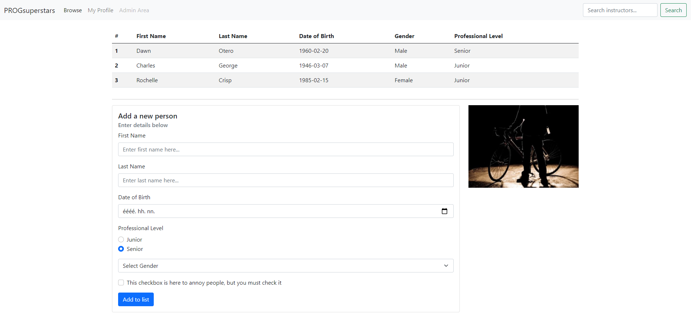
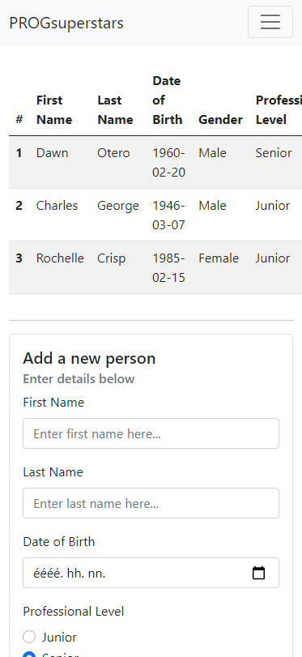
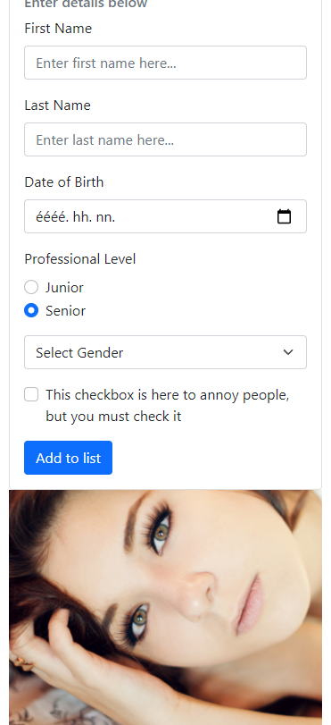

# Weboldal készítése Bootstrap segítségével

Készítsd el a képen látható weboldalt Bootstrap és SCSS segítségével! (kép a leírás alatt)

* Törekedj arra, hogy a weboldalad minél inkább hasonlítson a képekre!
* Csak a Bootstrap beépített eszköztárát (komponensek, classok stb.) használd a formázáshoz, 
  semmilyen (S)CSS szabályt ne definiálj, kivéve akkor, ha kifejezetten az a feladat!
* Az elkészült weboldal legyen reszponzív! (lásd képek)
* **Kis szélességű képernyő** alatt a 768 pixelnél szűkebb képernyőket értjük. (Bootstrap esetén `md` méret alatt.)
* A weblapot az index.html fájlban készítsd el!
* A Bootstrapet neked kell hozzáadnod a projekthez, ezt bármelyik tanult módon megteheted!
* Használd a megfelelő margint/paddinget biztosító Bootstrap osztályokat az elemek közötti üres terek
  megvalósításához!

## Navigációs menü (15%)

* A navigációs menü legyen reszponzív: kis szélességű képernyők esetén a menüpontok csak egy lenyíló menüből
  legyenek elérhetők, ehhez használd a Bootstrap beépített megoldását!
* A harmadik (Admin area) menüpont legyen letiltva.

## Táblázat (25%)

* A sorok háttérszíne legyen váltakozó!
* Figyelj a sorszámok formázására a sorok elején!
* Készíts egy SCSS mixint `hover-item()` néven a `styles.scss` fájlba:
    * A mixin állítsa a kurzort "mutató kézre", a szöveget pedig félkövérre.
    * Alkalmazd a mixint `<td>` elemekre `hover` esetén! Használj SCSS nestinget a megvalósításhoz!
    * Generálj CSS fájlt az SCSS fájlból, az elkészült stíluslapot hivatkozd be a weboldalon!
    * Commitold be a generált CSS (és map) fájlt is a megoldás beadásakor!

## Form (30% + DOM 15%)

* Használd a megfelelő Bootstrap **komponenst** az alapvető elrendezés megvalósításához!
* Figyelj arra, hogy a beviteli mezők típusa megfelelő legyen!
* A `Select Gender` legördülő menüben 3 érték közül választhassunk: Male, Female és Other.
* A form legyen 9 egység széles a Bootstrap grid rendszerében!
* Hozd létre a `script.js` fájlt, és implementáld az **Add to list** gomb működését a fájlban:
  * A gombra kattintáskor a táblázat végére szúrj be egy új sort a megfelelő adatokkal!
  * A formon semmilyen validációt nem kell végezned, a mezők értékeit se kell törölni a gombra kattintáskor.
  * Ha a táblázatot nem sikerült megvalósítani, akkor a konzolra logold ki a hozzáadandó új sor tartalmát!
  * Hivatkozd be a script fájlt a HTML fájlban! Ellenőrizd a helyes működést!

## Kép (form mellett) (15%)

* A kép legyen 3 egység széles a Bootstrap grid rendszerében!
* Kis szélességű képernyők esetén a kép a **form alatt** helyezkedjen el.
* Az alábbi URL legyen a kép forrása: http://placeimg.com/640/480/people

