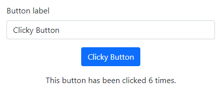

# Vizsga feladatok

## 1. Firebase-query (20%)
- Konzolon lépj be a mappába (cd ./firebase-query)
- Futtasd az "npm i" parancsot
- queries/firebase-init.js fájlba másold be a saját firebase azonosítód
  - nyugodtan lehet már meglévő projekt, ami fontos, hogy NE legyen meglévő "citizens" collection!
- futtasd az "npm run init-data" parancsot 
- ellenőrizd, hogy valóban megjelentek-e adatbázisban az adatok
- sok sikert a feladatokhoz!

## 2. Angular (40%)

### Projekt létrehozása (10%)

Hozz létre egy új Angular projektet `angular` néven a gyökér könyvtáron belül közvetlenül! (routing nélkül, SCSS használatával) Add hozzá a Bootstrap 5-öt a
projekthez tetszőleges módon!

### HTML váz létrehozása (20%)

Hozd létre a képen látható HTML felépítést Bootstrap használatával, az alábbi pontok figyelembevételével:

* Az oldal tartalma a Bootstrap grid rendszerében 4 egység széles legyen **medium vagy nagyobb képernyőkön**, és 
  középre legyen igazítva!
* A sorok közötti függőleges térközökre az `mt-3` vagy `mb-3` CSS osztályokat használd!

### Colored Button komponens (35%)

A képen látható kék gombhoz hozz létre egy új Angular komponenst `ColoredButton` néven!

* A komponens HTML template-je egy `button` taget tartalmazzon, használj Bootstrap osztályokat a formázáshoz!
* A komponensnek legyenek a következő bemenetei:
  * `label`: a gombon látható felirat
  * `isDisabled`: kattintható-e a gomb vagy sem
* A komponensnek legyenek a következő kimenetei:
  * `clicked`: esemény, amely a gombra kattintást jelzi

### Alkalmazás komponens (35%)

Valósítsd meg az alkalmazás komponens működését az alábbiak szerint:

* A gombot a `ColoredButton` komponens segítségével implementáld!
* A szövegbeviteli mező értéke legyen a gomb felirata. Ha üres a mező, akkor a gomb ne legyen kattintható, és a felirat
  legyen `Now you can't click me :(`!
* Az alsó sor számolja, hogy hányszor kattintott a felhasználó a gombra. (Amikor le van tiltva a gomb, azt nem kell számolni.)

## 3. TypeScript (40%)

A `typescript` mappában található `main.ts` fájlban dolgozz!

Definiálj TypeScript nyelven egy `Animal` osztályt egy konstruktorral, amely nevet ad az állatnak!
Definiálj két leszármazott osztályt, ezek legyenek a `Dog` és a `Cat`, mindkettőnek legyen egy `toString()` metódusa, 
amely stringként visszaadja az állat típusát és nevét!

Készíts egy `AnimalShelter` osztályt, amely állatokat tud tárolni!
* Az `addAnimal(animal: Animal)` metódus segítségével lehessen állatokat hozzáadni!
* A `printAnimals()` metódus iteráljon végig az állatokon, és a konzolra írja ki az állatok `toString()` metódusának
  visszatérési értékét!

Demonstráld az elkészült osztályok működését: hozz létre egy `AnimalShelter` objektumot, adj hozzá egy `Dog` és egy `Cat` objektumot, majd hívd meg a `printAnimals()`
metódust!
