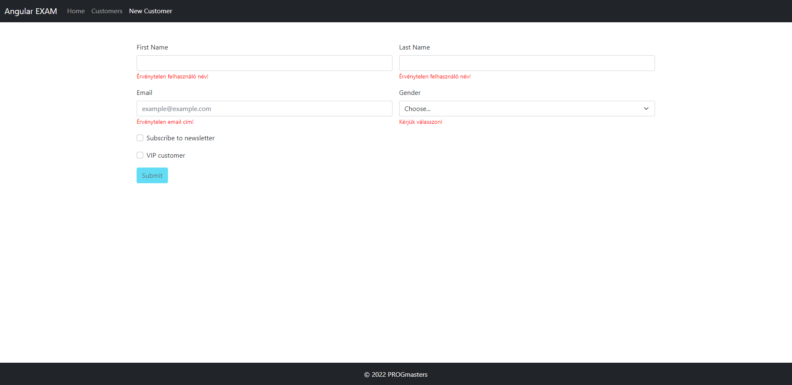
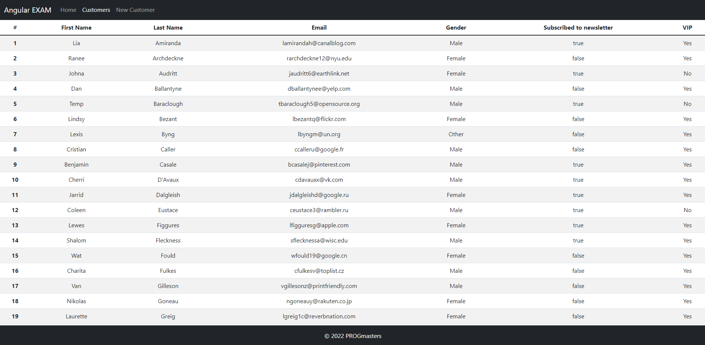

# Angular záróvizsga

## 1. Firebase hozzáadása a projekthez (20%)

Készíts egy Firebase projektet a tanult módon (projektnév: vezetéknév-keresztnév-angular-final, pl: kovacs-geza-angular-final (csak kis betű és NE használj ékezetet!). Egy-két betű eltérhet, ha foglalt a név.), majd konfiguráld az Angular projektet, hogy azt használja!

* Adj hozzá a Firebase projekthez egy webes alkalmazást! Ez lesz az Angular alkalmazás.
* Adatbázisnak `Firestore Database`-t használj!

Az `AngularFire` csomagot már tartalmazza a projekt, azt nem kell külön telepítened.

Az Angular alkalmazás elindítása után a home oldalon található gombbal tudod alaphelyzetbe állítani az adatbázisodat.
Ez töröl minden eddigi adatot, majd feltölti az induló adatokat.

## 2. Új vásárló létrehozása (35%)

Hozz létre egy új komponenst `CustomerFormComponent` néven, majd implementáld a képen látható formot! A form segítségével
`Customer` típusú objektumokat lehessen beszúrni az adatbázisba!

* Az új komponens az `AppModule` része legyen!
* A form HTML template kialakításához a Bootstrap eszköztárát használd!
* A form a fenti navigációs sávon a `New Customer` linkre kattintva legyen elérhető! (Routingot használj!)
* A form megvalósításához a `Reactive Forms` eszköztárát használd!
* A név mezők validálásához használj **custom validatort**, minden más mezőhöz használd a beépített validatorokat! Minden mező legyen kötelező!
* A validációs üzeneteket akkor írd ki, ha a mező `dirty` és `invalid`!
* A submit gomb legyen letiltva, ha a form nincs megfelelően kitöltve!
* Hozd létre a `createCustomer()` metódust a `CustomerService` osztályban, használd azt az új
  entitás létrehozásához a submit gombra kattintáskor!
  * A VIP checkbox értékétől függően az új elemet a `customer` vagy `vipCustomer` kollekcióba szúrd be!
  * A VIP checkbox értéke közvetlenül ne legyen beszúrva az adatbázisba!
  * Sikeres mentést követően állítsd a formot alaphelyzetbe, minden mező legyen üres!

## 3. Vásárlók listázása (45%)

Hozz létre egy új komponenst `CustomerListComponent` néven, majd implementáld a képen látható táblázatot! A táblázat az 
adatbázis `customer` és `vipCustomer` kollekcióiból lekérdezett elemeket jelenítse meg **összefésülve, vezetéknév szerint rendezve**!

* Az új komponens az `AppModule` része legyen!
* A form HTML template kialakításához a Bootstrap eszköztárát használd!
* A táblázat a fenti navigációs sávon a `Customers` linkre kattintva legyen elérhető! (Routingot használj!)
* A táblázat sorainak megjelenítéséhez `async` pipe-ot használj, egy `Observable`-re se legyen explicit `subscribe()` hívás!
* Hozd létre a `getCustomers()` és `getVipCustomers()` metódusokat a `CustomerService` osztályban, használd ezeket az 
  adatok lekérdezéséhez!
  * Az `isVIP` mező nem szerepel az adatbázisban, lekérdezés után azt manuálisan kell kitöltened.
  * Mindkét service metódus megfelelő típusú `Observable` objektumot adjon vissza!
  * A két `Observable` objektumot fésüld össze egy közös `Observable` objektumba, majd ezt a közös objektumot használd a sorok megjelenítésekor!
  * A vezetéknév szerinti rendezést a közös `Observable` objektumon végezd!
